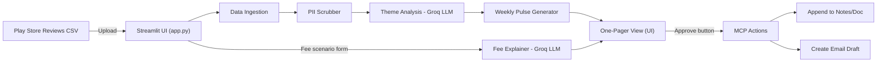
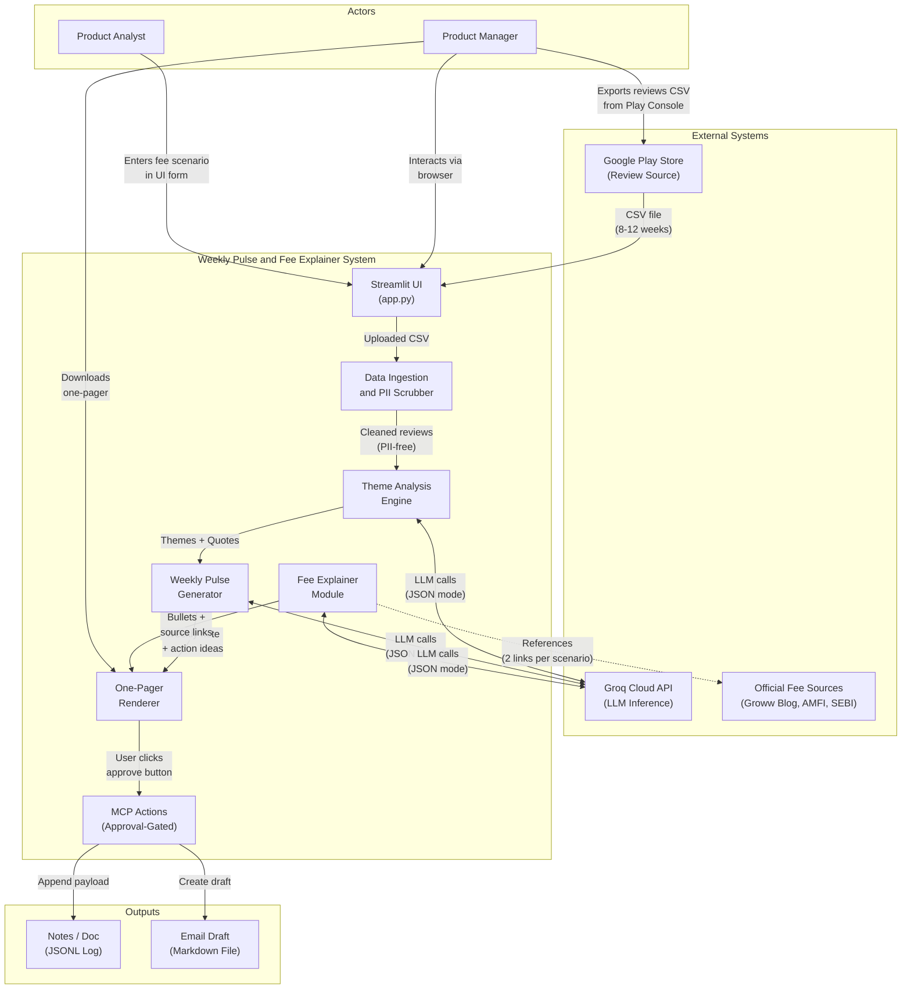
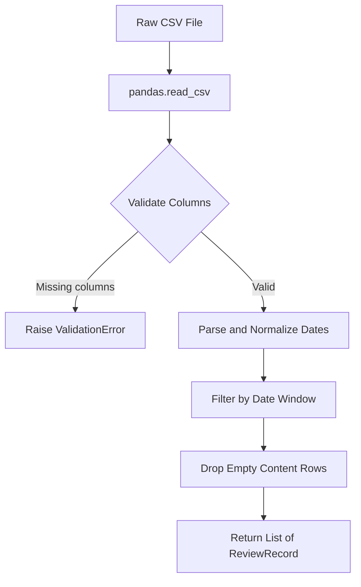
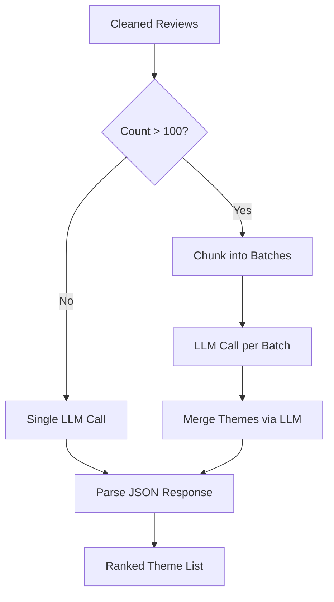
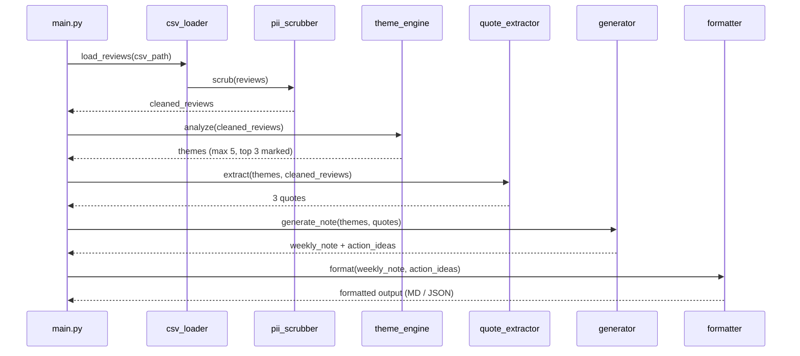
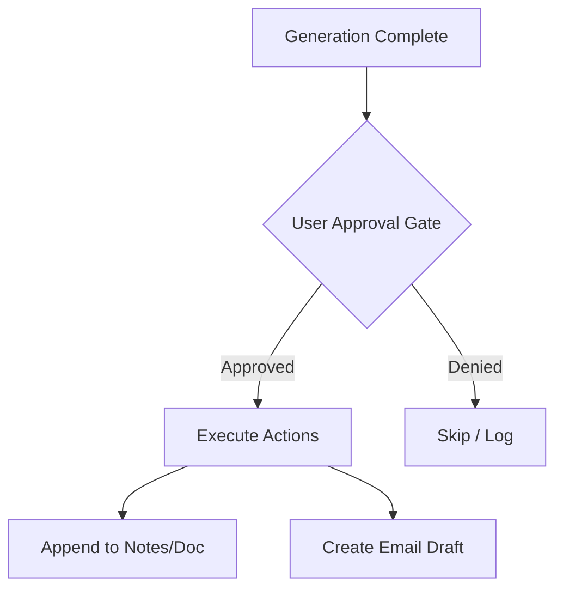
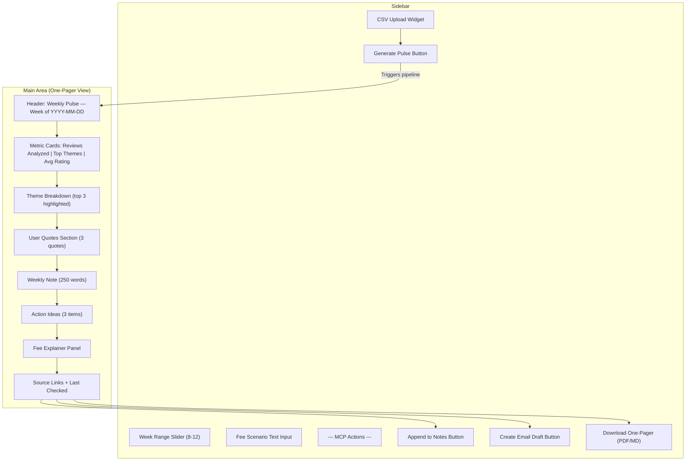
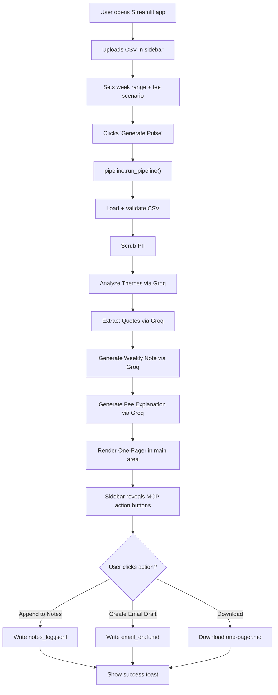

# Phase-Wise Architecture: Weekly Product Pulse and Fee Explainer

## 1. System Overview

A Python-based pipeline that transforms raw Groww Play Store reviews into a concise weekly pulse report and generates neutral fee explanations for mutual fund exit-load scenarios. The system uses **Groq LLM** for all generative tasks and exposes two **MCP actions** (approval-gated) for downstream delivery.

### High-Level Data Flow



### Target Product

**Groww** (`com.nextbillion.groww`) -- India's largest stock broker app with 100M+ downloads on Google Play. Reviews cover stocks, mutual funds, F&O trading, UX issues, customer support, and more.

---

## 2. System Context

The system context diagram below follows the C4 model (Level 1) and shows the boundary of the Weekly Pulse system, the actors that interact with it, and the external systems it depends on.



### Actors

| Actor            | Role                                                                                         |
|------------------|----------------------------------------------------------------------------------------------|
| Product Manager  | Exports Play Store reviews CSV, triggers the pipeline, approves MCP actions, reads the output |
| Product Analyst  | Provides fee scenario inputs, reviews the generated explanation for accuracy                  |

### External Systems

| System                  | Interaction                                                                                  |
|-------------------------|----------------------------------------------------------------------------------------------|
| Google Play Store       | Source of raw user reviews; the PM exports a CSV from the Play Console covering 8-12 weeks   |
| Groq Cloud API          | All LLM inference (theme grouping, quote extraction, note writing, fee explanation); called via the `groq` Python SDK with JSON-mode responses |
| Official Fee Sources    | Four reference URLs (Groww Blog, AMFI, SEBI) embedded as citation links in fee explainer output; not fetched at runtime -- used as static references |

### System Boundary

Everything inside the "Weekly Pulse and Fee Explainer System" box runs locally as a Python CLI application. It has no persistent server, no database, and no inbound network listeners. The only outbound network calls are to the Groq API. All outputs (notes log, email draft, pulse reports) are written to the local `output/` directory.

### Trust and Data Boundaries

```
┌─────────────────────────────────────────────────────┐
│  TRUSTED ZONE (local machine)                       │
│                                                     │
│  ┌───────────────┐   ┌──────────────────────────┐   │
│  │ Reviews CSV   │──>│ Ingestion + PII Scrubber  │   │
│  │ (may have PII)│   │ (removes PII before any   │   │
│  └───────────────┘   │  data leaves this zone)   │   │
│                      └──────────┬───────────────┘   │
│                                 │ PII-free text     │
│  ┌──────────────────────────────▼───────────────┐   │
│  │  Analysis / Pulse / Fee Explainer Modules    │   │
│  └──────────────────────────────┬───────────────┘   │
│                                 │                   │
├─────────────────────────────────┼───────────────────┤
│  EXTERNAL ZONE (network)       │                   │
│                                 ▼                   │
│                      ┌──────────────────┐           │
│                      │   Groq Cloud API  │           │
│                      │  (receives only   │           │
│                      │   PII-free text)  │           │
│                      └──────────────────┘           │
└─────────────────────────────────────────────────────┘
```

Key constraint: **No PII ever leaves the trusted zone.** The PII scrubber sits at the boundary and guarantees that all text sent to Groq has been sanitized. A second post-LLM scrub validates that no PII leaks into final outputs.

---

## 3. Project Structure

```
Weekly-Product-Pulse-and-Fee-Explainer/
├── ARCHITECTURE.md
├── README.md
├── requirements.txt
├── .env.example
├── app.py                                    # Streamlit entry point (Phase 6)
├── data/
│   └── sample_reviews.csv
├── src/
│   ├── __init__.py
│   ├── config.py                             # Shared config (used by all phases)
│   ├── pipeline.py                           # Orchestrator called by UI (Phase 6)
│   │
│   ├── phase1_data_ingestion/                # --- Phase 1 ---
│   │   ├── __init__.py
│   │   ├── csv_loader.py                     # CSV parsing and validation
│   │   └── pii_scrubber.py                   # PII removal (regex-based)
│   │
│   ├── phase2_theme_analysis/                # --- Phase 2 ---
│   │   ├── __init__.py
│   │   ├── groq_client.py                    # Groq SDK wrapper
│   │   ├── theme_engine.py                   # Theme grouping and ranking
│   │   └── quote_extractor.py                # Real user quote extraction
│   │
│   ├── phase3_weekly_pulse/                  # --- Phase 3 ---
│   │   ├── __init__.py
│   │   ├── generator.py                      # Weekly note generator
│   │   └── formatter.py                      # Markdown/JSON output formatting
│   │
│   ├── phase4_fee_explainer/                 # --- Phase 4 ---
│   │   ├── __init__.py
│   │   └── explainer.py                      # Fee scenario explanation engine
│   │
│   ├── phase5_mcp_actions/                   # --- Phase 5 ---
│   │   ├── __init__.py
│   │   ├── notes_append.py                   # Append-to-notes action
│   │   └── email_draft.py                    # Email draft creation action
│   │
│   └── phase6_ui_integration/                # --- Phase 6 ---
│       ├── __init__.py
│       ├── pages.py                          # Streamlit page layout and routing
│       ├── one_pager.py                      # One-pager visual renderer
│       └── components.py                     # Reusable UI widgets (cards, metrics)
│
├── tests/
│   ├── __init__.py
│   ├── phase1/
│   │   ├── __init__.py
│   │   ├── test_csv_loader.py
│   │   └── test_pii_scrubber.py
│   ├── phase2/
│   │   ├── __init__.py
│   │   └── test_theme_engine.py
│   ├── phase3/
│   │   ├── __init__.py
│   │   └── test_generator.py
│   ├── phase4/
│   │   ├── __init__.py
│   │   └── test_fee_explainer.py
│   ├── phase5/
│   │   ├── __init__.py
│   │   └── test_mcp_actions.py
│   └── phase6/
│       ├── __init__.py
│       └── test_ui.py
│
└── output/
    └── .gitkeep
```

---

## 4. Phase 1 -- Project Setup and Data Ingestion

### 4.1 Objective

Stand up the project skeleton, dependency management, and a robust CSV ingestion pipeline that cleans, validates, and prepares Play Store reviews for downstream LLM processing.

### 4.2 Dependencies (`requirements.txt`)

```
groq>=0.12.0
python-dotenv>=1.0.0
pandas>=2.2.0
pydantic>=2.6.0
streamlit>=1.39.0
pytest>=8.0.0
```

### 4.3 CSV Ingestion Module (`src/ingestion/csv_loader.py`)

Responsibilities:
- Parse the Play Store reviews CSV (expected columns: `reviewId`, `userName`, `content`, `score`, `thumbsUpCount`, `reviewCreatedVersion`, `at`, `replyContent`, `repliedAt`).
- Filter reviews to the configured date window (last 8-12 weeks from run date).
- Normalize dates to ISO 8601.
- Drop rows with empty `content`.



**Data Model** (`pydantic`):

```python
class ReviewRecord(BaseModel):
    review_id: str
    content: str
    score: int                # 1-5 star rating
    date: datetime
    thumbs_up: int = 0
```

### 4.4 PII Scrubber (`src/ingestion/pii_scrubber.py`)

Regex-based PII removal applied to every review `content` field before any LLM call.

| PII Type       | Pattern                                         | Replacement     |
|----------------|--------------------------------------------------|-----------------|
| Email          | `[\w.-]+@[\w.-]+\.\w+`                           | `[EMAIL]`       |
| Phone (IN)     | `(\+91[\s-]?)?[6-9]\d{9}`                        | `[PHONE]`       |
| Phone (intl)   | `\+?\d{1,3}[\s-]?\d{6,14}`                       | `[PHONE]`       |
| Aadhaar        | `\d{4}[\s-]?\d{4}[\s-]?\d{4}`                    | `[ID]`          |
| PAN            | `[A-Z]{5}\d{4}[A-Z]`                             | `[ID]`          |
| Person names   | Post-LLM check -- any output names cross-checked | `[NAME]`        |

The scrubber runs in two passes:
1. **Pre-LLM pass**: Cleans raw review text before sending to Groq.
2. **Post-LLM pass**: Validates LLM output to catch any leaked PII.

### 4.5 Configuration (`src/config.py`)

```python
GROQ_API_KEY          # from .env
GROQ_MODEL            # default: "llama-3.3-70b-versatile"
REVIEW_WINDOW_WEEKS   # default: 8
MAX_THEMES            # default: 5
TOP_THEMES            # default: 3
MAX_QUOTES            # default: 3
PULSE_WORD_LIMIT      # default: 250
FEE_BULLET_LIMIT      # default: 6
```

---

## 5. Phase 2 -- Theme Analysis Engine (Groq LLM)

### 5.1 Objective

Use Groq's ultra-fast inference to cluster cleaned reviews into a maximum of 5 themes, rank the top 3, and extract 3 verbatim (PII-free) user quotes.

### 5.2 Groq Client Wrapper (`src/analysis/groq_client.py`)

- Initializes the `Groq` client with the API key from config.
- Provides a `chat_completion(system_prompt, user_prompt, temperature, max_tokens)` method.
- Enforces JSON mode via `response_format={"type": "json_object"}` for structured outputs.
- Implements retry logic (3 attempts, exponential backoff) for transient API errors.

### 5.3 Theme Grouping (`src/analysis/theme_engine.py`)

**Prompt Template -- Theme Grouping:**

```
SYSTEM:
You are a product analyst. Analyze the provided app reviews and group them
into at most {MAX_THEMES} distinct themes. Rank each theme by frequency and
sentiment impact. Return JSON only.

USER:
Here are {n} recent user reviews for the Groww app (a stock trading and
mutual fund platform):

{reviews_block}

Return a JSON object with this exact structure:
{
  "themes": [
    {
      "rank": 1,
      "name": "<short theme name>",
      "description": "<1-sentence summary>",
      "sentiment": "positive|negative|mixed",
      "review_count": <number>,
      "sample_review_ids": ["id1", "id2"]
    }
  ]
}

Rules:
- Maximum {MAX_THEMES} themes.
- Rank by combined frequency and negative-sentiment weight.
- Do not include any personally identifiable information.
```

**Batching strategy**: If the review set exceeds the model context window, chunk reviews into batches of ~100 and merge theme results with a second LLM call.



### 5.4 Quote Extraction (`src/analysis/quote_extractor.py`)

**Prompt Template -- Quote Extraction:**

```
SYSTEM:
You are a product analyst. From the provided reviews, extract exactly 3
real user quotes that best represent the top themes. Quotes must be
verbatim excerpts (may be trimmed for length). No PII allowed.

USER:
Top 3 themes: {themes_json}

Reviews: {reviews_block}

Return JSON:
{
  "quotes": [
    {
      "text": "<verbatim quote, max 50 words>",
      "theme": "<matching theme name>",
      "star_rating": <1-5>
    }
  ]
}
```

---

## 6. Phase 3 -- Weekly Pulse Generator

### 6.1 Objective

Combine theme analysis and quotes into a single, polished weekly pulse note (max 250 words) with 3 action ideas.

### 6.2 Orchestration Flow (`src/pulse/generator.py`)



### 6.3 Weekly Note Generation

**Prompt Template -- Weekly Note:**

```
SYSTEM:
You are a product communications writer. Write a concise weekly pulse note
for the Groww product team. Tone: professional, data-informed, constructive.

USER:
Week ending: {week_end_date}
Review count analyzed: {total_reviews}

Top themes:
{themes_summary}

Representative quotes:
{quotes_block}

Write a weekly note (MAXIMUM 250 words) that:
1. Opens with the overall sentiment trend.
2. Highlights the top 3 themes with brief context.
3. Includes the 3 user quotes inline.
4. Ends with exactly 3 specific, actionable ideas for the product team.

Return JSON:
{
  "weekly_note": "<the 250-word note>",
  "action_ideas": [
    "<action 1>",
    "<action 2>",
    "<action 3>"
  ],
  "word_count": <number>
}
```

### 6.4 Output Formatter (`src/pulse/formatter.py`)

Produces two output formats:
- **Markdown** -- human-readable report saved to `output/pulse_YYYY-MM-DD.md`.
- **JSON** -- machine-readable payload for MCP actions, saved to `output/pulse_YYYY-MM-DD.json`.

---

## 7. Phase 4 -- Fee Explainer Module

### 7.1 Objective

Generate a structured, neutral explanation of a mutual fund fee scenario (e.g., exit load) in at most 6 bullet points, with 2 official source links and a "Last checked" timestamp.

### 7.2 Fee Explainer Engine (`src/fee_explainer/explainer.py`)

**Available Source Links (pick 2 per scenario):**

| # | URL                                                                      |
|---|--------------------------------------------------------------------------|
| 1 | `https://groww.in/blog/what-is-exit-load-in-mutual-funds`                |
| 2 | `https://www.amfiindia.com/investor-corner/knowledge-center/exit-load.html` |
| 3 | `https://www.sebi.gov.in/individual-investors.html`                      |
| 4 | `https://groww.in/mutual-funds/help/transaction-related/exit-load`       |

**Prompt Template -- Fee Explainer:**

```
SYSTEM:
You are a neutral financial information assistant. Explain fee structures
using only verified facts. Never make recommendations. Never compare
products. Maintain a strictly informational tone.

USER:
Scenario: {scenario_description}

Generate a structured explanation with these rules:
1. Maximum 6 bullet points.
2. Each bullet must be a factual statement about the fee/charge.
3. Include exactly 2 official source links from: {source_links_list}
4. Add a "Last checked: {current_date}" line at the end.
5. No recommendations, no comparisons, no opinions.

Return JSON:
{
  "scenario": "<scenario name>",
  "bullets": [
    "<bullet 1>",
    "<bullet 2>"
  ],
  "source_links": [
    {"title": "<display text>", "url": "<url>"}
  ],
  "last_checked": "YYYY-MM-DD"
}
```

### 7.3 Tone Guardrails

A post-generation validation step checks the output for:
- Comparative language ("better than", "cheaper than", "best", "worst").
- Recommendation language ("you should", "we recommend", "consider").
- Superlatives and subjective adjectives.

If any are detected, the output is regenerated with a stricter prompt addendum.

---

## 8. Phase 5 -- MCP Actions (Approval-Gated)

### 8.1 Objective

Expose two MCP (Model Context Protocol) actions that require explicit user approval before execution. These actions deliver the generated outputs to downstream systems.

### 8.2 Action Flow



### 8.3 Action 1: Append to Notes/Doc (`src/mcp_actions/notes_append.py`)

Appends a structured JSON payload to a local notes file or connected document store.

**Payload Schema:**

```json
{
  "date": "2026-03-21",
  "weekly_pulse": {
    "week_ending": "2026-03-21",
    "total_reviews": 347,
    "themes": [ ... ],
    "quotes": [ ... ],
    "weekly_note": "...",
    "action_ideas": [ ... ]
  },
  "fee_scenario": "Mutual Fund Exit Load",
  "explanation_bullets": [ ... ],
  "source_links": [
    {"title": "...", "url": "..."},
    {"title": "...", "url": "..."}
  ]
}
```

**Implementation details:**
- Target file: `output/notes_log.jsonl` (one JSON object per line, append-only).
- Validates payload against schema before writing.
- Logs the action with timestamp for audit trail.

### 8.4 Action 2: Create Email Draft (`src/mcp_actions/email_draft.py`)

Generates a draft email file (does NOT send).

**Email Structure:**

```
Subject: Weekly Pulse + Fee Explainer — {YYYY-MM-DD}

Body:
---
WEEKLY PULSE
Week ending: {date}
Reviews analyzed: {count}

{weekly_note_text}

---
FEE EXPLAINER
Scenario: {scenario}

{bullet_points}

Sources:
- {link_1}
- {link_2}

Last checked: {date}
---
```

**Implementation details:**
- Output: `output/email_draft_YYYY-MM-DD.md`
- No SMTP integration -- file-based draft only.
- The MCP action surfaces this as a confirmable action; the user must approve before the file is written.

### 8.5 Approval Gate (UI-Driven)

The approval gate is rendered as interactive buttons inside the Streamlit sidebar after the one-pager has been generated. No terminal prompts are involved.

```python
# Inside app.py — rendered after generation completes
st.sidebar.markdown("---")
st.sidebar.subheader("MCP Actions")

col1, col2 = st.sidebar.columns(2)
if col1.button("Append to Notes", type="primary"):
    notes_append.execute(payload)
    st.sidebar.success("Appended to notes_log.jsonl")

if col2.button("Create Email Draft", type="primary"):
    draft_path = email_draft.execute(payload)
    st.sidebar.success(f"Draft saved: {draft_path}")
    with open(draft_path) as f:
        st.sidebar.download_button("Download Draft", f.read(), file_name=draft_path.name)
```

Both buttons are disabled until the pipeline finishes. Each click writes to `output/audit.log` with the action name, timestamp, and result status.

---

## 9. Phase 6 -- Streamlit UI, Integration, and Testing

### 9.1 Streamlit Application (`app.py`)

Launch the entire system from a single command:

```
streamlit run app.py
```

The UI is the primary interface -- there is no separate CLI. All pipeline stages, one-pager rendering, and MCP actions are triggered through the browser.

### 9.2 UI Layout and Page Flow



### 9.3 UI Screens Detail

**Screen 1 -- Upload and Configure (Sidebar)**

| Widget            | Type                | Purpose                                      |
|-------------------|---------------------|----------------------------------------------|
| CSV Upload        | `st.file_uploader`  | Accepts `.csv` file of Play Store reviews    |
| Week Range        | `st.slider`         | Select 8-12 week analysis window             |
| Fee Scenario      | `st.text_input`     | Fee scenario description (default: "Mutual Fund Exit Load") |
| Generate Button   | `st.button`         | Triggers the full pipeline                   |

**Screen 2 -- One-Pager (Main Area)**

After the user clicks "Generate Pulse", the main area renders a single-page report with these sections stacked vertically:

| Section             | Component                  | Content                                         |
|---------------------|----------------------------|-------------------------------------------------|
| Header              | `st.title` + `st.caption`  | "Weekly Pulse -- Week of {date}" + review count |
| Metric Cards        | `st.columns` + `st.metric` | Total reviews, top theme name, average rating   |
| Theme Breakdown     | Expandable cards           | All themes (max 5), top 3 highlighted with color |
| User Quotes         | `st.info` blocks           | 3 verbatim quotes with star rating badges       |
| Weekly Note         | `st.markdown`              | The generated 250-word note                     |
| Action Ideas        | Numbered `st.success` list | 3 actionable suggestions                        |
| Fee Explainer       | `st.markdown` in box       | Bullet points with neutral tone                 |
| Sources             | `st.markdown` links        | 2 official URLs + "Last checked: {date}"        |

**Screen 3 -- MCP Actions (Sidebar, post-generation)**

After the one-pager renders, the sidebar reveals two action buttons and a download button:

| Button              | Behavior                                                      |
|---------------------|---------------------------------------------------------------|
| Append to Notes     | Writes structured JSON to `output/notes_log.jsonl`            |
| Create Email Draft  | Generates `output/email_draft_YYYY-MM-DD.md` with full body  |
| Download One-Pager  | Exports the rendered one-pager as a downloadable Markdown file |

Each action shows a `st.success` or `st.error` toast on completion and logs to `output/audit.log`.

### 9.4 One-Pager Renderer (`src/ui/one_pager.py`)

This module takes the pipeline output (themes, quotes, weekly note, action ideas, fee explanation) and renders the complete one-pager layout. It is the visual heart of the application.

```python
def render_one_pager(pulse_data: dict, fee_data: dict):
    """Renders the full one-pager in the Streamlit main area."""
    # Header
    st.title(f"Weekly Pulse — Week of {pulse_data['week_ending']}")
    st.caption(f"{pulse_data['total_reviews']} reviews analyzed")

    # Metric cards row
    cols = st.columns(3)
    cols[0].metric("Reviews", pulse_data["total_reviews"])
    cols[1].metric("Top Theme", pulse_data["themes"][0]["name"])
    cols[2].metric("Avg Rating", f"{pulse_data['avg_rating']:.1f}")

    # Theme breakdown, quotes, note, actions, fee explainer ...
```

### 9.5 Pipeline Orchestrator (`src/pipeline.py`)

A UI-agnostic orchestrator that the Streamlit app calls. This keeps business logic decoupled from the UI layer.

```python
def run_pipeline(csv_bytes: bytes, weeks: int, fee_scenario: str) -> tuple[dict, dict]:
    """
    Runs the full pipeline and returns (pulse_data, fee_data).
    Called by app.py when the user clicks "Generate Pulse".
    """
    reviews = csv_loader.load(csv_bytes, weeks)
    cleaned = pii_scrubber.scrub(reviews)
    themes = theme_engine.analyze(cleaned)
    quotes = quote_extractor.extract(themes, cleaned)
    pulse = generator.generate_note(themes, quotes)
    fee = explainer.explain(fee_scenario)
    return pulse, fee
```

### 9.6 End-to-End Flow (UI-Driven)



### 9.7 Testing Strategy

| Test File                  | Covers                                              |
|----------------------------|------------------------------------------------------|
| `test_pii_scrubber.py`     | Email, phone, Aadhaar, PAN detection and redaction   |
| `test_theme_engine.py`     | JSON parsing, theme count cap, ranking order         |
| `test_fee_explainer.py`    | Bullet count limit, source link count, tone check    |
| `test_formatter.py`        | Markdown structure, JSON schema compliance           |

### 9.8 Sample CSV (`data/sample_reviews.csv`)

A 50-row sample file with synthetic reviews covering typical Groww themes (app crashes, slow withdrawals, good UI, F&O charting, customer support) for local development without needing a real data export.

---

## 10. Environment and Configuration

### `.env.example`

```
GROQ_API_KEY=gsk_xxxxxxxxxxxxxxxxxxxxxxxxxxxx
GROQ_MODEL=llama-3.3-70b-versatile
REVIEW_WINDOW_WEEKS=8
```

### Error Handling

| Scenario                    | Behavior                                                    |
|-----------------------------|--------------------------------------------------------------|
| No CSV uploaded             | "Generate" button stays disabled; sidebar shows info hint   |
| Invalid CSV format          | `st.error` banner with column mismatch details              |
| Groq API key not set        | `st.error` banner with `.env` setup instructions on app load |
| Groq rate limit (429)       | Retry with exponential backoff (max 3 attempts); spinner stays active |
| LLM returns malformed JSON  | Retry once with stricter prompt; then `st.error` with details |
| PII detected in output      | Re-scrub and show `st.warning` toast                        |
| Empty review set after filter | `st.warning` banner: "No reviews found in the selected date range" |

---

## 11. Technology Stack Summary

| Layer              | Technology                         |
|--------------------|------------------------------------|
| Language           | Python 3.11+                       |
| LLM Provider       | Groq (`llama-3.3-70b-versatile`)   |
| Data Handling      | pandas, pydantic                   |
| UI / Frontend      | Streamlit                          |
| Testing            | pytest                             |
| Output Formats     | Markdown, JSON, JSONL              |

---

## 12. Groq LLM Integration Notes

- **Model**: `llama-3.3-70b-versatile` (fast inference, strong instruction-following).
- **JSON mode**: All prompts request `response_format={"type": "json_object"}` for reliable structured output.
- **Temperature**: `0.3` for analysis tasks (themes, quotes), `0.5` for generative tasks (weekly note, fee explanation).
- **Max tokens**: 2048 per call (sufficient for all output types).
- **Rate limits**: Groq free tier allows ~30 requests/minute; the pipeline makes 4 LLM calls per run, well within limits.

---

## 13. Security and Compliance

- **No PII in outputs**: Two-pass scrubbing (pre-LLM and post-LLM).
- **No auto-send**: Email drafts are file-based; no SMTP credentials stored.
- **API key management**: `.env` file excluded from version control via `.gitignore`.
- **Audit log**: Every MCP action is logged with timestamp and approval status to `output/audit.log`.
